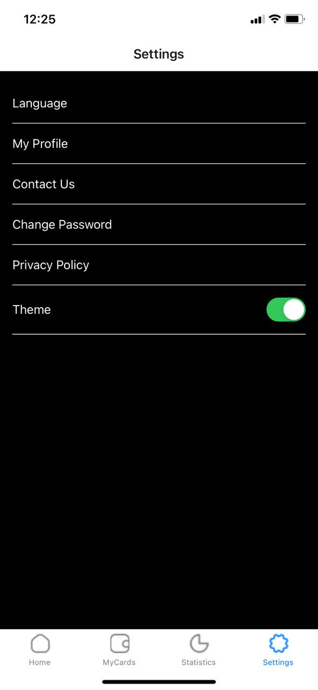
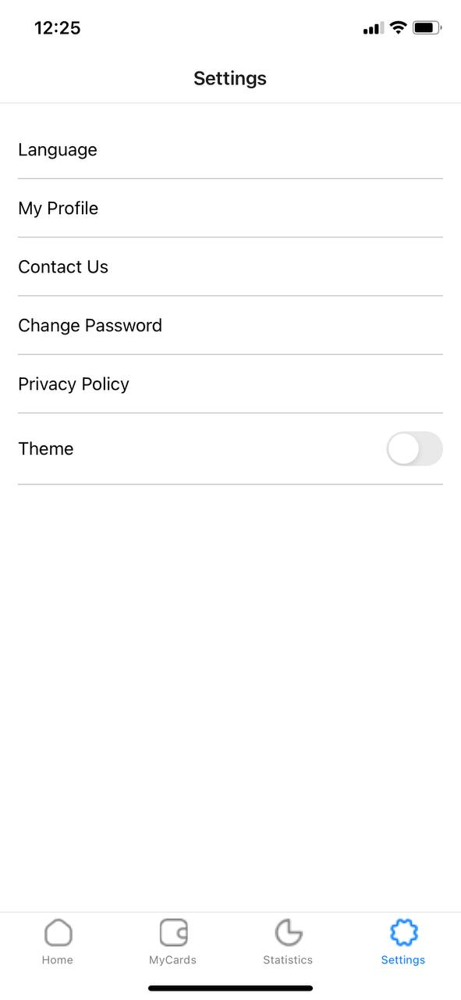
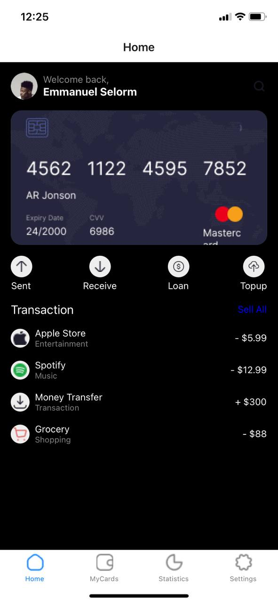
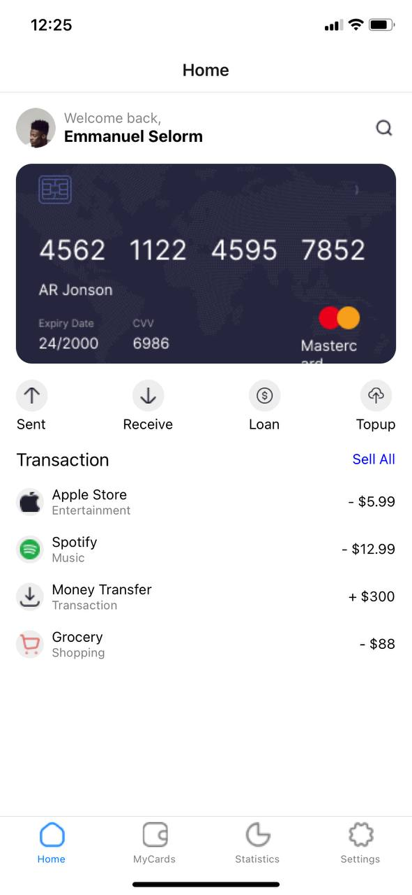

App Selorm
Overview
This React Native app, built using Expo, is a semester project designed to demonstrate the implementation of a theme toggle feature and tab navigation. The app consists of two main screens: the Home Screen and the Settings Screen. Users can switch between a dark theme and a light theme using a toggle switch on the Settings Screen. The app also utilizes tab navigation to allow easy switching between the screens.

Features
Home Screen: The main screen of the app where primary content is displayed.
Settings Screen: Allows users to toggle between dark and light themes.
Theme Toggle: Users can switch between dark and light themes using a toggle switch.
Tab Navigation: Seamless navigation between Home Screen and Settings Screen using tab navigation.
Installation
Ensure you have Node.js and Expo CLI installed.
Clone the repository to your local machine.
Navigate to the project directory.
Run npm install to install the necessary dependencies.
Run expo start to start the development server.
Usage
Open the Expo app on your mobile device or use an emulator to scan the QR code displayed in the terminal.
Navigate between the Home Screen and Settings Screen using the tab navigation at the bottom of the screen.
Use the toggle switch on the Settings Screen to switch between dark and light themes.
Dependencies
React Native: A framework for building native apps using React.
Expo: A platform for making universal React apps.
React Navigation: Used for implementing tab navigation.
Project Structure
App.js: The entry point of the application.
screens/: Contains the HomeScreen and SettingsScreen components.
navigation/: Contains the navigation configuration.
Contributing
Fork the repository.
Create a new branch (git checkout -b feature-branch).
Make your changes and commit them (git commit -m 'Add some feature').
Push to the branch (git push origin feature-branch).
Open a pull request.
License
This project is licensed under the MIT License.

Contact
For any questions or feedback, please reach out via email at [esnartey002@st.ug.edu.gh.com].

## Screenshots
 
 
 
